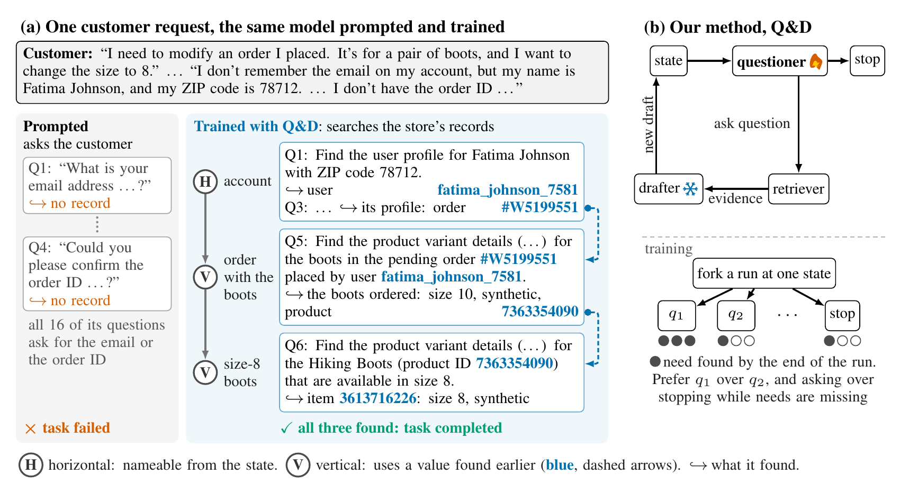
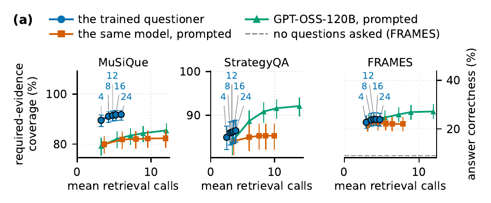
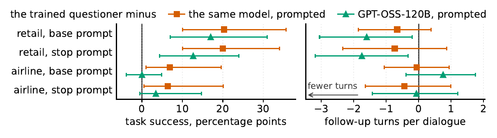

<div align="center">

# 🔎 ProactiveInquirer

<picture>
  <source media="(prefers-color-scheme: dark)" srcset="docs/assets/title-dark.png">
  
</picture>

[**Ido Levy**](https://scholar.google.com/citations?user=Ok_7M80AAAAJ)<sup>1,2</sup> · [**Asaf Yehudai**](https://scholar.google.com/citations?user=FprEf4oAAAAJ)<sup>1</sup> · [**Segev Shlomov**](https://scholar.google.com/citations?user=hhtOihkAAAAJ)<sup>1</sup> · [**Asaf Adi**](https://www.linkedin.com/in/asaf-adi/)<sup>1</sup> · [**Leshem Choshen**](https://scholar.google.com/citations?user=8b8IhUYAAAAJ)<sup>1,2</sup>

<sup>1</sup>IBM &nbsp;&nbsp; <sup>2</sup>Weizmann Institute of Science

[](https://dolev31.github.io/ProactiveInquirer/)
[](https://arxiv.org/abs/2609.37236)
[](https://doi.org/10.5281/zenodo.23023448)
[](https://huggingface.co/dolev31/ProactiveInquirer-Qwen3-8B)
[](https://github.com/dolev31/ProactiveInquirer/actions/workflows/tests.yml)
[](LICENSE)
[](pyproject.toml)

</div>

<p align="center">
  
</p>

> **TL;DR.** Tool-using agents do what they are asked, yet a task often needs information the user
> never mentions. We study *what* an agent pursues unasked, measure it against need graphs with no
> model judge, and train it with **Q&D** from the consequences of its own questions. The trained 8B
> questioner finds more of what a task requires than the same model prompted, beats a prompted model
> 15× larger on two of three benchmarks, and more than doubles task success in a customer-service
> agent it was never trained on.

## 📰 News

- **2026-09** · The code, the need-graph metrics and the trained questioner
  ([🤗 ProactiveInquirer-Qwen3-8B](https://huggingface.co/dolev31/ProactiveInquirer-Qwen3-8B)) are
  public, with a [project page](https://dolev31.github.io/ProactiveInquirer/). The paper is on [arXiv](https://arxiv.org/abs/2609.37236).

## ✨ Highlights

- **A new axis of proactivity: its content.** Work on proactive agents mostly asks *whether* and
  *when* an agent should act on its own. We ask *what* it should go after, in two forms:
  - **Horizontal**, a need the current state already names. A customer gives a name and a ZIP code,
    so the agent looks up the account.
  - **Vertical**, a need that only newly found evidence names. The account lists the order, the order
    names the product, and the product lists the size-8 variant.
- **Measured without a judge.** A need graph, recovered from a benchmark's own decomposition, records
  which needs depend on which, so both forms, and whether the agent stops at the right time, are
  scored from a transcript. Agents are compared after the same number of questions, so asking more
  cannot pass for asking better.
- **Trained from consequences.** Q&D (questioner and drafter) forks a run, continues it after several
  candidate questions, and prefers the question whose continuation retrieves more of the required
  evidence. No reward model, no model judge.
- **It transfers.** With no further training, the questioner makes a customer-service agent complete
  more tasks, and it asks less and finds more: fewer questions, more of which reach the records the task needs.

## 📊 Results

On held-out test splits (MuSiQue at equal retrieval spend, τ²-bench under the benchmark's own per-dialogue caps):

| Setting | Measure | Qwen3-8B, prompted | **Q&D questioner** |
|---|---|---|---|
| MuSiQue | Required evidence recovered | 78% | **90%** |
| τ²-bench retail, base prompt (no further training) | Task success | 13% | **34%** |
| τ²-bench retail, stop prompt (no further training) | Task success | 12% | **32%** |

- It improves both forms of proactivity over the same model, prompted, on MuSiQue, StrategyQA and
  2WikiMultiHopQA, and outperforms GPT-OSS-120B, prompted in the same role, on two of the three.
- The gain comes from *what* it asks, not from asking more or longer questions: it holds against a
  question-volume control and a length control.
- In retail it completes more tasks than GPT-OSS-120B with fewer follow-up turns from the customer.

<p align="center">
  
</p>
<p align="center">
  
</p>

## 🚀 Quick start

Requires Python 3.12 and [uv](https://docs.astral.sh/uv/).

```bash
git clone https://github.com/dolev31/ProactiveInquirer.git && cd ProactiveInquirer
uv venv --python 3.12
uv pip install -e ".[dev,run,suites,analysis,tau2]"
make gate     # ruff, format, the 4 import contracts, the suite audit, unit tests, path guard
make smoke    # end to end on a synthetic suite
```

After the install, `make gate` and `make smoke` need no API keys. `make smoke` builds a synthetic suite
whose need graphs have closed-form answers, runs three offline arms on it, compacts and scores the
runs, and checks the gold firewall. `make gate` is what CI runs.

## 🤗 Use the trained questioner

The questioner is a LoRA adapter on Qwen3-8B. The
[model card](https://huggingface.co/dolev31/ProactiveInquirer-Qwen3-8B) has a complete, tested example
with the prompt template it was trained on.

```python
import torch
from peft import PeftModel
from transformers import AutoModelForCausalLM, AutoTokenizer

tok = AutoTokenizer.from_pretrained("Qwen/Qwen3-8B")
base = AutoModelForCausalLM.from_pretrained(
    "Qwen/Qwen3-8B", dtype=torch.bfloat16, device_map="auto"
)
questioner = PeftModel.from_pretrained(base, "dolev31/ProactiveInquirer-Qwen3-8B")
```

It replies with one JSON action per step: `{"action": "ask", "question": ...}` or
`{"action": "stop", ...}`.

To run it on your own machine, there are
[GGUF files](https://huggingface.co/dolev31/ProactiveInquirer-Qwen3-8B-GGUF) for Ollama, LM Studio and
llama.cpp, and [merged weights](https://huggingface.co/dolev31/ProactiveInquirer-Qwen3-8B-Merged) that
need no PEFT:

```bash
ollama run hf.co/dolev31/ProactiveInquirer-Qwen3-8B-GGUF:Q4_K_M --think=false
```

## 🧭 How it works

```
            ┌──────────────┐  ask one question   ┌───────────┐  evidence  ┌───────────────────┐
  state ──▶ │  questioner  │ ──────────────────▶ │ retriever │ ─────────▶ │  drafter (frozen) │
    ▲       │  (trained)   │ ── or stop          └───────────┘            └───────────────────┘
    └───────┴──────────────┘◀────────────────────── new draft ──────────────────────┘
```

- **The loop.** A questioner asks one question at a time or stops, a retriever answers it from the
  task's evidence, and a frozen drafter folds the evidence into a draft. Because the drafter is a
  fixed function of the evidence, every change in what the agent holds is caused by a question.
- **Training.** Imitation of good decisions first, then direct preference optimization on question
  pairs, then on question pairs and stop contrasts together. Every label comes from what followed a
  question.
- **Your own agent.** `pinq` depends on nothing outside the standard library. Implement the
  `Retriever`, `Drafter` and `Answerer` protocols from `pinq.protocols` and pass them to `run_loop`:

```python
from pinq.budget import BudgetLedger
from pinq.loop import run_loop

trajectory = run_loop(
    view=task_view,  # what the agent may see of the task
    inquirer=questioner,  # asks one question or stops
    retriever=my_retriever,
    drafter=my_drafter,  # must be pure in (view, evidence, seed)
    answerer=my_answerer,
    ledger=BudgetLedger(cap=8),
    max_turns=16,
)
```

## 🔬 Reproduce the experiments

**Configure.** Model calls go through LiteLLM, so any OpenAI-compatible endpoint works:

```bash
cp .env.example .env              # an endpoint and one model pin per role
set -a; . ./.env; set +a
.venv/bin/pi env doctor           # one short live call per pinned model; prints no secrets
```

**Build the data.** No benchmark text is redistributed. Each suite is downloaded, checked against a
pinned sha256, and split into a public corpus (the only thing an agent may read) and a gold need graph
(read only by the scorer):

```bash
.venv/bin/pi data fetch --suite musique
.venv/bin/pi data build --suite musique
.venv/bin/pi suites map           # which suites train the questioner and which measure it
```

**Run, score, report.**

```bash
.venv/bin/pi run --suite musique --split test --n 200 --seeds 0 1 \
    --arm inquirer_prompted --arm inquirer_trained
.venv/bin/pi compact                          # runs/ -> scores/parquet/
PI_GOLD_ROOT=data/gold .venv/bin/pi score     # the only step that reads gold
.venv/bin/pi agg --primary                    # tables, each with a provenance record
```

The other arms (controls such as `inquirer_depth1` and `random_q`, baselines such as `self_ask`,
`ircot` and `par2_rag`, and ceilings such as `gold_evidence`) are defined in `src/pinq_expt/arms.py`.

**Train.** `pi train` runs the ladder (install the GPU stack with `uv pip install -e ".[train]"`):

| Command | Step |
|---|---|
| `pi train frontier-states` | Find the recorded states where a choice of question existed |
| `pi train sample-candidates` | Fork each state into candidate continuations |
| `pi train export` | Turn recorded runs into SFT rows and preference pairs (reads gold) |
| `pi train rung1` | Imitation (rejection-sampling SFT) |
| `pi train rung2` | Direct preference optimization on same-state pairs |
| `pi train eval-offline` | Dev NLL, stop decisions and pair accuracy for a checkpoint |

`docs/TRAINING.md` explains each stage, and `docs/GPU_RUNBOOK.md` goes from an empty rented GPU box to
a registered, served checkpoint.

## 🗂 Repository layout

| Path | Contents |
|---|---|
| `src/pinq/` | The agent loop, types, budget ledger and protocols (standard library only) |
| `src/pinq_adapters/` | One adapter per benchmark, and the LLM client |
| `src/pinq_expt/` | The arms that are compared, including controls and baselines |
| `src/pi_eval/` | Gold-only: need graphs, matchers, metrics and statistics |
| `src/pi_run/` | The `pi` CLI: sweeps, response cache, manifests, scoring and reports |
| `src/pinq_train/` | The training ladder |
| `conf/` | Sweep grids, training and serving configs, the checkpoint registry |
| `scripts/` | Tools beside the CLI, and the analysis behind each study ([index](scripts/README.md)) |
| `docs/` | Data, suites, metrics, training, reproduction and design decisions |
| `tests/` | More than 5,000 tests |

## 📚 Documentation

| File | Read it for |
|---|---|
| [`docs/DATA.md`](docs/DATA.md) | Each data source, its licence, and how to fetch and build it |
| [`docs/SUITES.md`](docs/SUITES.md) | Which suites train the questioner and which measure it |
| [`docs/PROACTIVITY_METRICS.md`](docs/PROACTIVITY_METRICS.md) | The metrics and what each one measures |
| [`docs/RUNBOOK.md`](docs/RUNBOOK.md) | From a clean machine to a result, command by command |
| [`docs/REPRODUCE.md`](docs/REPRODUCE.md) | What reproducible means here, and how to check it |
| [`docs/TRAINING.md`](docs/TRAINING.md) | The training ladder, stage by stage |
| [`docs/GPU_RUNBOOK.md`](docs/GPU_RUNBOOK.md) | From an empty rented GPU box to a served checkpoint |
| [`docs/DECISIONS.md`](docs/DECISIONS.md) | The judgement calls the code depends on, with their defaults |
| [`docs/CONVLOG.md`](docs/CONVLOG.md) | The rules for turning agent-session transcripts into training data; the transcripts are not released |

## 🤝 Contributing

Issues and pull requests are welcome. The working rules are in [`CONTRIBUTING.md`](CONTRIBUTING.md),
and code comments cite them as "CONTRIBUTING.md rule N". In short: every reported number traces to a
`run_id`, a `scorer_hash` and a `graph_version`; a fix comes with the test that failed without it; and
a failing test is never weakened to pass. The code enforces a gold firewall: `pi_eval` is gold-only
and nothing outside it may import it, which an import contract, a type wall, a process split and canary
nonces hold together.

## 📝 Citation

If you use this code or the model, please cite:

```bibtex
@article{levy2026asking,
  title   = {Asking for What Was Never Requested: Horizontal and Vertical Proactivity in Agents},
  author  = {Levy, Ido and Yehudai, Asaf and Shlomov, Segev and Adi, Asaf and Choshen, Leshem},
  journal = {arXiv preprint arXiv:2609.37236},
  url     = {https://arxiv.org/abs/2609.37236},
  year    = {2026}
}
```

## 📄 License

Apache-2.0 (see [`LICENSE`](LICENSE)). Benchmarks keep their own licences and are not redistributed
here.
